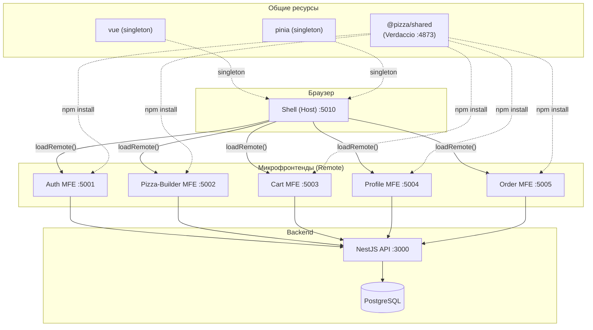
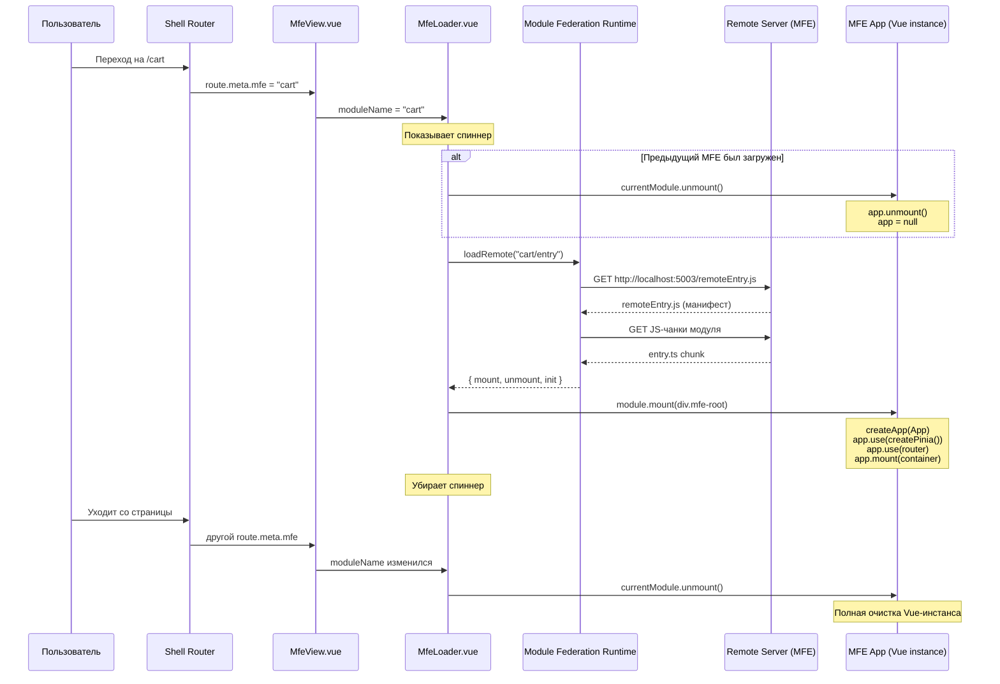
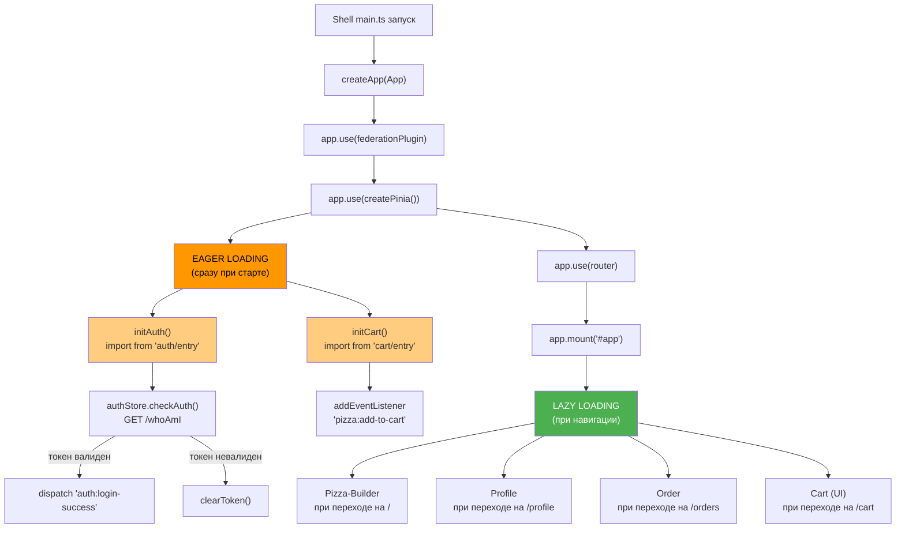
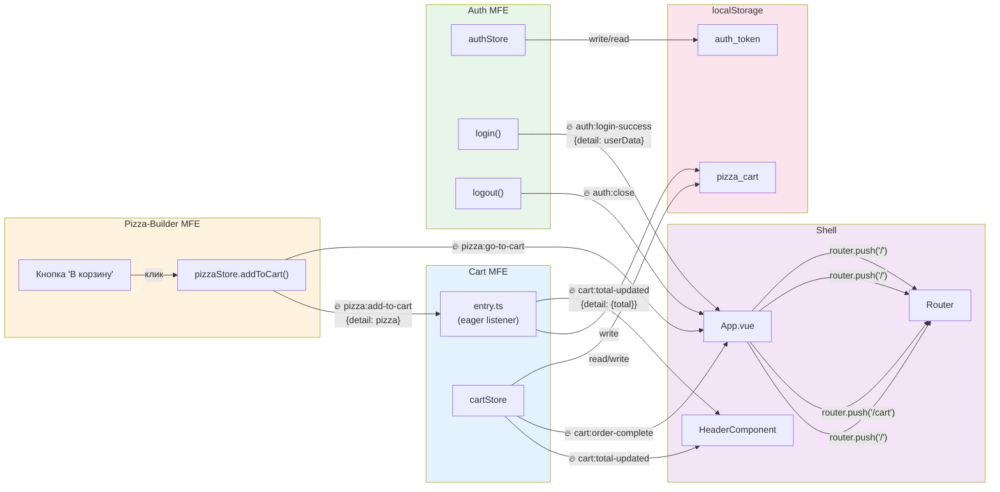
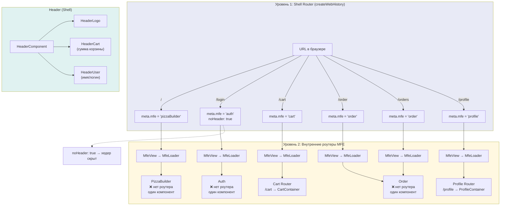
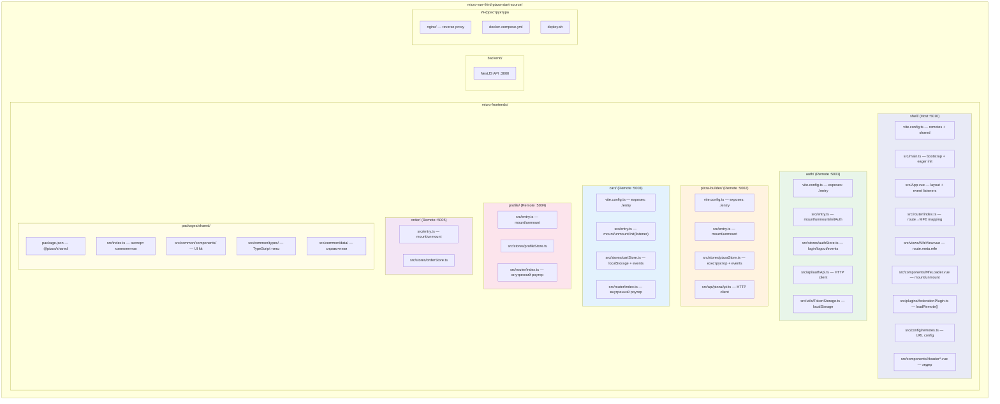
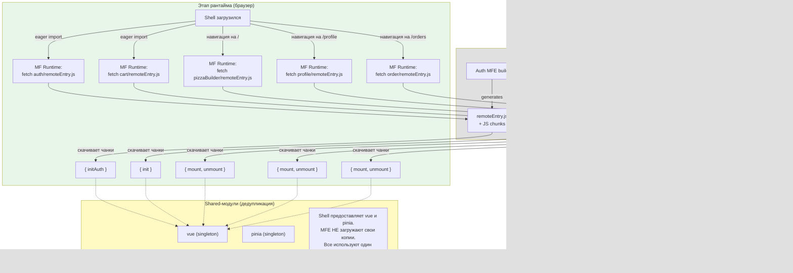
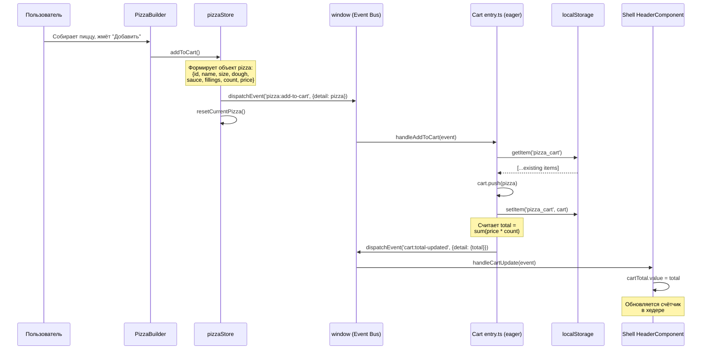
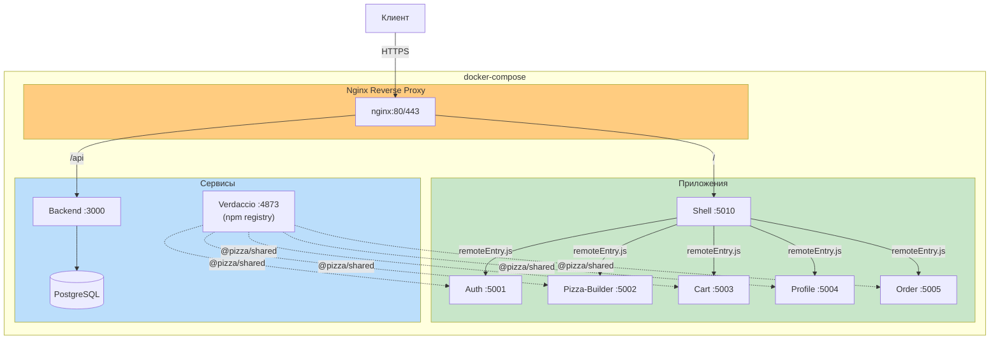

# Архитектура микрофронтендов Pizza App

## 1. Общая архитектура системы

---

## 2. Схема маунта MFE (жизненный цикл)

---

## 3. Eager vs Lazy загрузка (инициализация Shell)

---

## 4. Схема общения между MFE (Custom Events)

---

## 5. Схема роутинга (двухуровневый)

---

## 6. Файловая архитектура

---

## 7. Module Federation — схема взаимодействия в рантайме

---

## 8. Полный цикл добавления пиццы в корзину (Data Flow)

---

## 9. Схема деплоя (Docker)

---

## Легенда

| Символ | Значение |
|--------|----------|
| `→` сплошная | Прямой вызов / загрузка |
| `-.->` пунктир | Зависимость / npm-пакет |
| `🔥 event:name` | Custom Event через window |
| `singleton` | Один экземпляр на всё приложение |
| `:5010` | Порт сервера |
